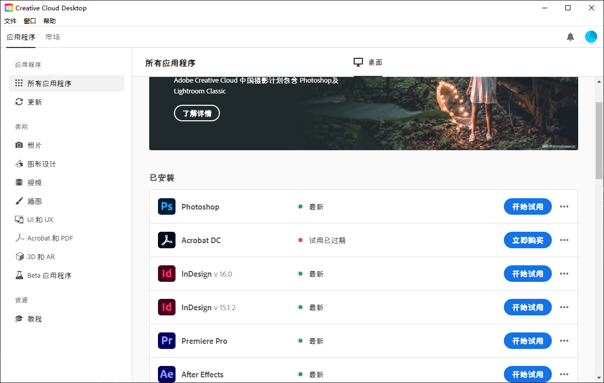
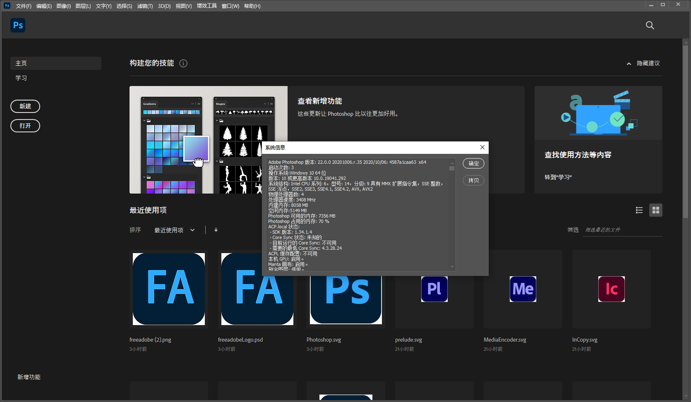

# Re:Free Adobe 2.2（2023-12-4更新）

更新内容 - 支持2024版本、修补错误。

@亦泽同学 | 复活版 by Aunt Studio(@Aunt_nuozhen)

## 公告

如果您使用Clash for Windows等软件进行代理并且尝试破解PS 2023，请按此操作:

此处以Clash for Windows为例。

1. 打开设置
2. 找到System Proxy 设置项
3. 点击`Bypass Domain/IPNet` 右边的 Edit 按钮


4.它应该会打开一个Visual Studio Code或其它默认文本编辑器的窗口。


5.在倒数第二行（<`local>`的上面）插入新行。


6.填入
```
  - '*.adobe.io'
```


7.保存，关闭窗口。

此时即使开着代理，也能正常阻止*.adobe.io的出站。


## 简介

FreeAdobe是一款Adobe优化软件，可以优化Adobe CC系列的各种软件，支持2019系列、2020系列、2021系列、2022系列、2023系列

例如 Photoshop 2023、Photoshop 2022、Photoshop 2021、Photoshop 2020、Photoshop 2019、Acrobat Pro DC 2019、Acrobat Pro DC 2020等所有2019版后的版本。

优化之后即可解除授权限制，无限使用。而且FreeAdobe支持软件升级，在升级之后再按照使用方式操作一遍即可随时享用最新版本。

> 目前，Acrobat 2023版本无法使用本软件破解，请另寻途径。如有新方法将第一时间更新。

## 使用方式

1、去Adobe官网下载[Creative Cloud](https://creativecloud.adobe.com/apps/download/creative-cloud?locale=zh-cn)并且安装

[https://creativecloud.adobe.com/apps/download/creative-cloud?locale=zh-cn](https://creativecloud.adobe.com/apps/download/creative-cloud?locale=zh-cn)

2、通过Creative Cloud下载你想要的应用比如Photoshop（需要登录Adobe ID）



3、在本软件(FreeAdobe)内找到你下载的版本，点击优化即可使用


4、注意不要更改adobe系列软件的安装目录 (C盘)



## 更新地址

最新版本的FreeAdobe下载地址【支持adobe 2019 2020 2021 2022 2023全家桶】：

[Github Releases](https://github.com/yangnuozhen/ReFreeAdobe/releases)

原作地址：

[https://bestyize.github.io/adobe/freeadobe](https://bestyize.github.io/adobe/freeadobe)
